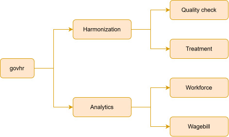
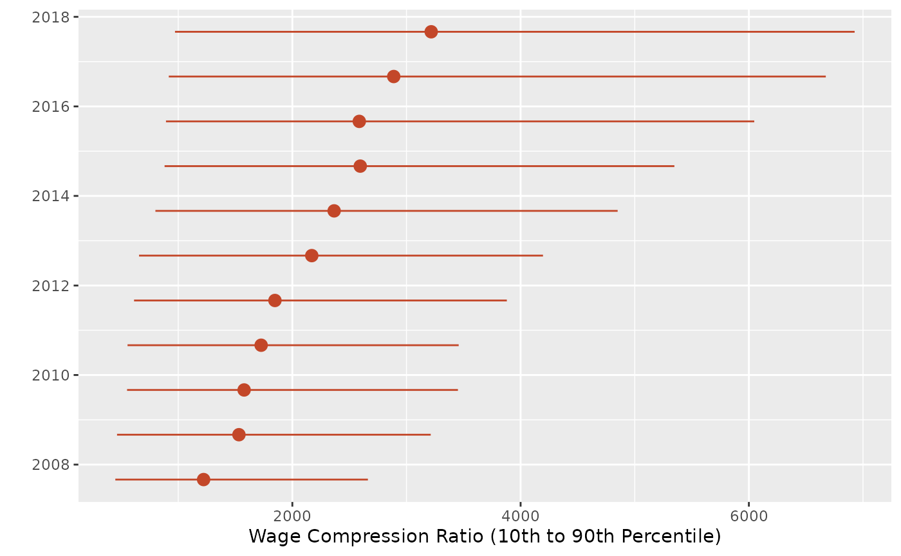

# govhr

``` r

library(govhr)
```

## Introduction to govhr

Across the world, public sectors employ over 400 million workers ([World
Bank
2026](https://www.worldbank.org/en/publication/public-workforce-performance-and-prosperity)).
The wage bill of this public sector workforce represents around 40
percent of government expenditure. Helping governments better manage
their large and complex workforce, while ensuring fiscal sustainability
of their wage bill, is a priority for the World Bank’s Governance Global
Practice.

## Why `govhr`?

We believe that better management of human resources should be
evidence-based. This means that governments need to have access to
high-quality data on their workforce and wagebill, and the tools to
analyze them in a systematic way. So far, this journey from raw data to
analytics has been an odyssey.

On the data engineering side, human resources (HR) data are complex and
large. In addition, governments collect data in their own unique
conventions, defying a common data standard. The lack of a common set of
rulers to measure the workforce and wage bill makes it difficult to
generate analytics from data.

On the analytics side, governments have specific business problems and
policy questions that defy a one-size-fits-all approach. One government
might be trying to reform its pensions program. Another, ensuring that
its workforce is adequately staffed. Each one of these business cases
requires a different type of analysis.

The `govhr` package offers solutions to these challenges. It provides a
set of open-source tools for harmonizing and analyzing HR data, enabling
evidence-based human resource management.

## `govhr`: an overview

`govhr` has two components: a backend and a frontend. The backend
handles the data engineering or, as we prefer to call it, the
harmonization. The frontend handles analytics, including functions that
compute indicators and visualizes them in plots.



govhr: architecture

### Harmonization

The harmonization backend takes raw, country-specific HR data and
re-expresses it using a common data dictionary, so that personnel and
contract records become comparable across countries and over time.
Typical harmonization tasks include checking whether raw data sources
share a consistent schema, applying a standard treatment pipeline to
remove duplicates and correct implausible values, and assessing the
coverage (completeness) of the resulting harmonized dataset.

``` r

# check whether column names are consistent across raw data sources
df1 <- data.frame(personnel_id = 1, ref_date = "2020-01-01", age = 34)
df2 <- data.frame(personnel_id = 2, ref_date = "2020-01-01", gender = "F")

find_inconsistent_colnames(list(df1, df2))
#> # A tibble: 2 × 1
#>   colnames
#>   <chr>   
#> 1 age     
#> 2 gender
```

`govhr` provides a standard approach to treating data, formalized in the
`clean_hr_data`. While the standard approach might not be best suited
for your use case, it can serve as a starting point to formalize your
own treatment plan.

``` r

# apply the standard treatment pipeline to raw personnel data
personnel_clean <- clean_hr_data(
  bra_hrmis_personnel,
  data_type = "personnel",
  verbose = TRUE
)
#> Starting HR data cleaning pipeline...
#>   - Removed 0 duplicate records
#>   - Fixed invalid dates (set out-of-bounds to NA)
#>   - Handled age issues (flagged underage and over-retirement)
#> Cleaning complete. 14106 records retained (0 removed).
```

Once the data is treated, you might want to assess the coverage of the
data. A set of functions, such as `compute_coverage`, allow you to
quickly check this aspect of quality of the data.

``` r

# assess coverage (share of non-missing values) by employment status
compute_coverage(
  personnel_clean,
  group_cols = "employment_status"
)
#>     employment_status              variable  coverage
#>                <char>                <char>     <num>
#>  1:            active          personnel_id 100.00000
#>  2:            active              ref_date 100.00000
#>  3:            active            birth_date 100.00000
#>  4:            active                   age 100.00000
#>  5:            active                gender 100.00000
#>  6:            active               educat7  97.50210
#>  7:            active          service_type 100.00000
#>  8:            active                  race   0.00000
#>  9:            active                 tribe   0.00000
#> 10:            active first_employment_date 100.00000
#> 11:            active       retirement_date   0.00000
#> 12:            active         underage_flag 100.00000
#> 13:            active  over_retirement_flag 100.00000
#> 14:         pensioner          personnel_id 100.00000
#> 15:         pensioner              ref_date 100.00000
#> 16:         pensioner            birth_date  99.20983
#> 17:         pensioner                   age 100.00000
#> 18:         pensioner                gender 100.00000
#> 19:         pensioner               educat7  99.94147
#> 20:         pensioner          service_type 100.00000
#> 21:         pensioner                  race   0.00000
#> 22:         pensioner                 tribe   0.00000
#> 23:         pensioner first_employment_date 100.00000
#> 24:         pensioner       retirement_date 100.00000
#> 25:         pensioner         underage_flag 100.00000
#> 26:         pensioner  over_retirement_flag 100.00000
#>     employment_status              variable  coverage
#>                <char>                <char>     <num>
```

### Analytics

Once data are harmonized, the analytics frontend turns personnel and
contract records into indicators that governments can use to answer
specific policy questions: How compressed is the wage structure? Is the
workforce growing or shrinking? How is headcount distributed across
groups?

`govhr` provides functions to compute these indicators, along with
companion plotting functions to visualize them.

For example, a government might be curious about wage equity. In
particular, whether or not its compression ratio, meaning the ratio
between the 90th and 10th percentile of wages, has changed over time.
The snippet above concisely analyzes the evolution of the compression
ratio, over time.

``` r

# wage compression: ratio between the 90th and 10th percentile of gross salary,
# tracked over time
compression_ratio <- compute_compression_ratio(
  bra_hrmis_contract,
  measure_col = "gross_salary_lcu"
)

plot_compression_ratio(compression_ratio)
```



Another government may want to know whether there was an increase in the
number of personnel with higher education. The `compute_growth` function
quickly computes that growth rate, by group.

``` r

# growth in headcount from the first to the last reference date, by service type
compute_growth(
  bra_hrmis_personnel,
  group_col = "educat7"
)
#> # A tibble: 7 × 2
#>   educat7                                  growth_rate
#>   <chr>                                          <dbl>
#> 1 Secondary complete                              56.7
#> 2 Higher than secondary but not university        29.6
#> 3 Secondary incomplete                             9.4
#> 4 Primary complete                                15.7
#> 5 Primary incomplete                              -5.7
#> 6 University incomplete or complete               40.7
#> 7 No education                                   -25
```
